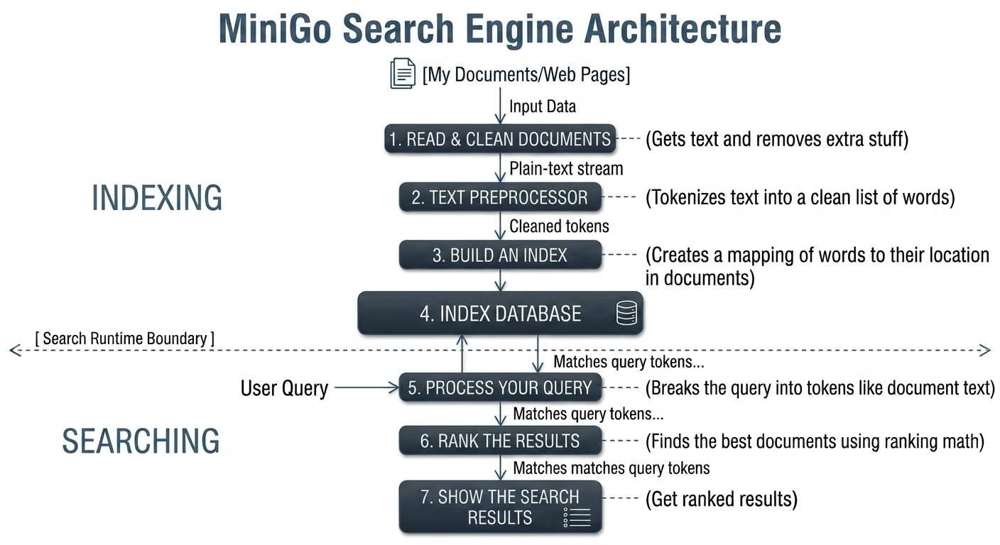
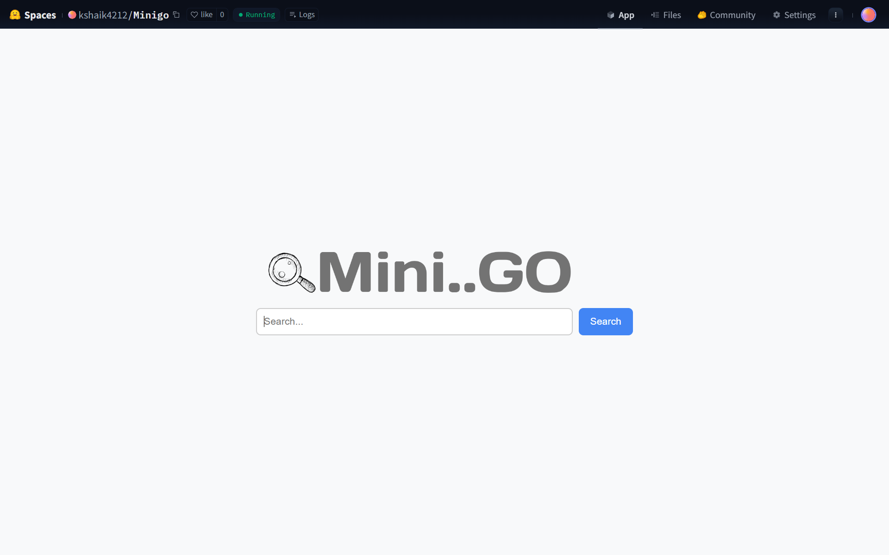
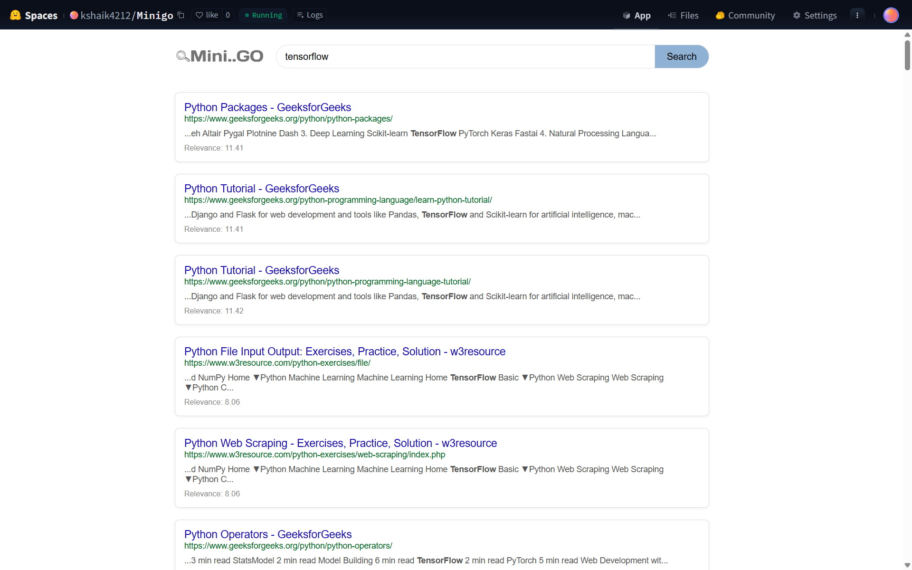

# MiniGo Search Engine

A simple, lightweight web search engine built from scratch using **Python**, **Flask**, and **SQLite**. 

🚀 **[Live Demo on Hugging Face Spaces](https://huggingface.co)**

---

## 🎯 Scope & Dataset

* **Narrow Search Focus:** This is a specialized, niche search engine.
* **Target Index:** It crawls a limited pool of targeted web pages.
* **Content Domain:** All indexed data centers strictly around **Python tutorials**.
* **Live Sources:** Explores high-quality resource domains like GeeksforGeeks and w3resource.

---

## 📐 Architecture Overview

MiniGo separates its workflow into two core processes: **Indexing** (offline data preparation) and **Searching** (runtime execution).



### The 7-Step Pipeline:
1. **Read & Clean Documents:** Ingests raw documents or web pages, extracting raw text and discarding irrelevant markup.
2. **Text Preprocessor:** Tokenizes text streams into clean, standard lists of keywords.
3. **Build an Index:** Generates an inverted index mapping tokens directly to their document occurrences.
4. **Index Database:** Commits the index structural data permanently into a local SQLite repository.
5. **Process Your Query:** Breaks down incoming runtime user queries into query tokens matching the index schema.
6. **Rank the Results:** Scores relevant documents using TF-IDF mathematical formulas and PageRank values.
7. **Show the Search Results:** Computes the top ranks and serves a structured list back to the frontend.

---

## 🚀 Features

* **Web Crawling:** Automates the collection and parsing of structured web target pages.
* **Inverted Indexing:** Speeds up search matching significantly by organizing terms cleanly.
* **TF-IDF Ranking:** Measures term frequencies and inverse document frequencies to rank content by exact keyword relevance.
* **PageRank Integration:** Factors in page authority by tracking inter-link mechanics across indexed sites.
* **Query Suggestions:** Provides instant autocomplete dropdown matches to assist user typing.

---

## 📸 Screenshots

### Home Page UI
A minimalist, modern search bar layout designed for immediate entry.


### Search Results Interface
Renders clean text snippets alongside calculated page link targets and precise algorithmic relevance scores.


---

## 🛠️ How to Run Locally

Follow these simple setup steps to run MiniGo natively on your machine:

### 1. Initialize the Database
Set up the SQLite database schemas and target structures:
```bash
python database.py
```

### 2. Index Web URLs
Execute the crawler script to process `urls.txt` and populate your inverted index:
```bash
python indexer.py
```

### 3. Launch the Application
Start your Flask local development server:
```bash
python app.py
```
Once running, open your browser and navigate to `http://127.0.0.1:5000` to start searching!

---

## 🚢 Deployment Workflow

This project utilizes a dual-repository development workflow split between local building, version control, and cloud container hosting:

1. **Source Code Control (GitHub):** The primary Python core files are tracked locally and pushed to the [GitHub Repository](https://github.com).
2. **Containerized Hosting (Hugging Face):** To host the demo in the cloud, custom `Dockerfile` templates are applied locally to containerize the Flask process and map its exposure on Hugging Face's default web runtime interface port (`7860`).

---

## 🧰 Tech Stack

* **Backend:** Python, Flask
* **Database:** SQLite
* **Frontend:** HTML, CSS
* **Hosting Platform:** Hugging Face Spaces (Custom Docker Runtime)
